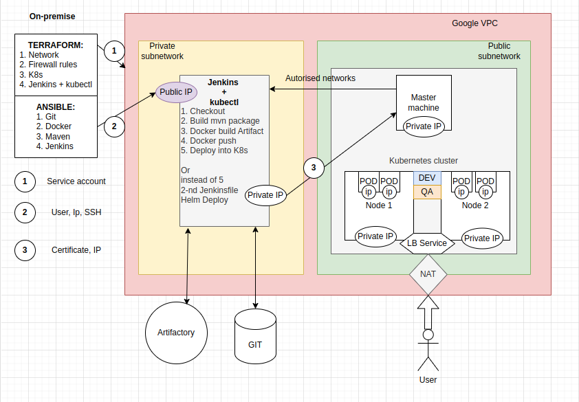
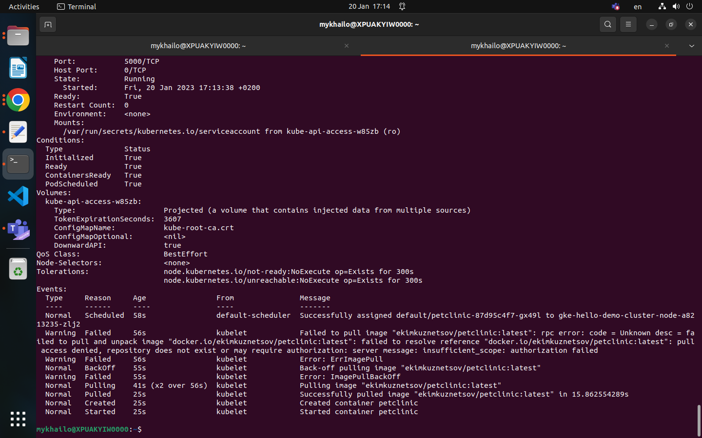
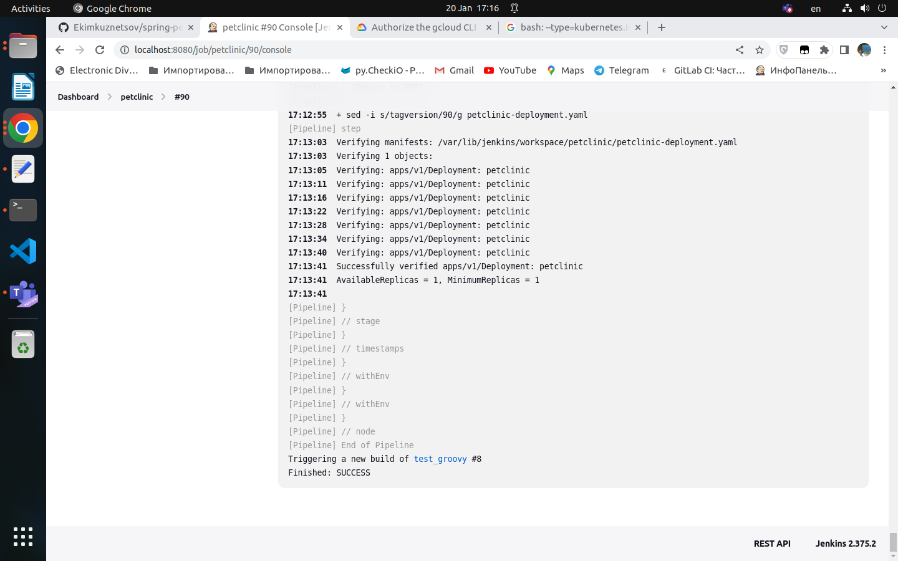
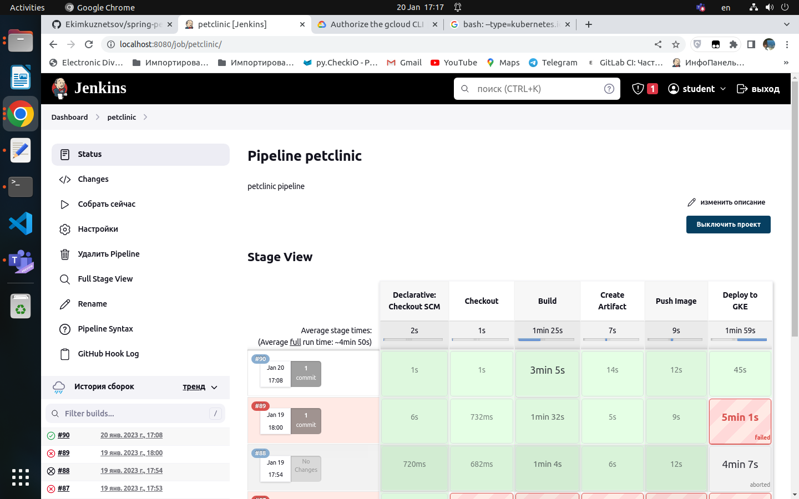
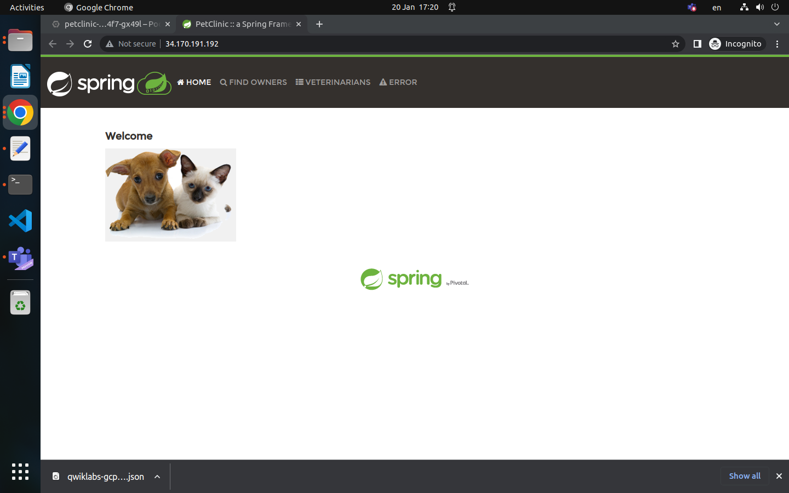
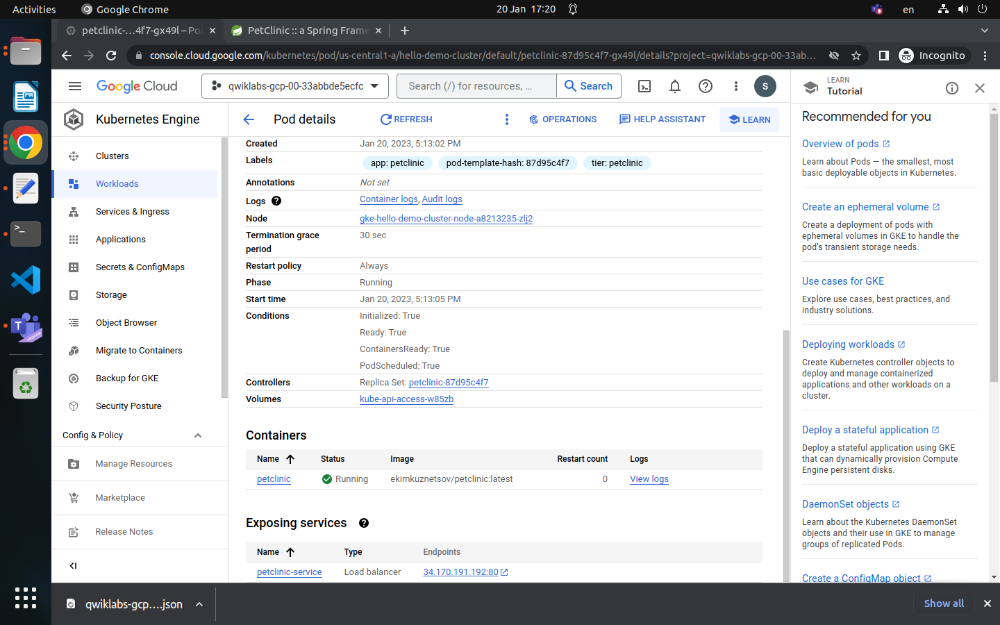

Technical Task

---
## INTRODUCTION 

 
This is your general course work, which covered of CI/CD pipeline with Git, Ansible, Docker, Jenkins, Cloud tools. 

## SUCCESS CRITERIA 

  
After the course, on the interview, you should demonstrate simple CI/CD pipeline, which handle build and deploy of simple Spring Boot application with the next scenarios: 

 

    • Jenkins should build each Pull Requests for verifications
    • Jenkins should pull latest changes and build service after each commit to develop/master branch via any trigger 
    • Jenkins should create artifact of the service and upload to storage system 
    • Jenkins should triggering deployment of CI environment after each success build with latest built artifact (Continuous Integration / Continuous Deployment) 
    • Jenkins should deploy QA environment with the any created artifact on demand (Continuous Delivery) 
    • During interview, student should demonstrate coursework to an interviewer for discussion 

 
## REQUIREMENTS: 
 

    • Any Public Cloud Free Tier account, like AWS/AZURE/GCP
    • Any Public SCM account, like GitHub/GitLab/Bitbucket  
 
## STEP BY STEP
**Step 1: SCM activities**

Login to SCM under your account and fork Spring Boot example to your new public repository with the any name. Application example https://github.com/spring-projects/spring-petclinic 

 
**Step 2: Cloud activities** 

    • All Public Cloud infrastructure should be created via Terraform 
    • Possible infrastructure approach 
        ◦ All located in Compute service 
        ◦ Mix of Compute and Containers services 
        ◦ All located in Containers services (mostly preferred) 
 

**Step 3: Prepare DevTools** 

DevTools: latest JDK8, Git, Jenkins and Ansible. As an artifact storage solution you could use Docker Trusted Registry, Jfrog Artifactory, Nexus or any other 
 

**Step 4: Configure CI/CD tools** 
 

*DTR/Artifactory/Nexus*: 
 

    • Create repository for artifacts. Also, this repository will be used for deployment procedure 
    • Create user, which will have access to created repository 
 
*Jenkins*: 
 

    • Install required plugin, like git, maven, matrix role 
    • Disable anonymous access and create some user 
    • Create build pipeline flow with the next steps - CHECKOUT, BUILD, CREATE ARTIFACT, DEPLOY 
    • Create deployment jobs for CI and QA environment's 
 
Steps descriptions: 
 

    • CHECKOUT: should be triggered after each commit to develop/master branch in repository 
    • BUILD: to build application use ./mvnw package 
    • CREATE ARTIFACT: create Docker Image or Jar and push it to artifactory storage. Artifact should have next name convention: <application-name>.<build-version> 
    • CI DEPLOY: Ansible role should deploy latest version of application from artifactory storage to CI environment 
 
*Ansible*: 

    • Create deployment role which pull and run application. 
        ◦ For JAR – use next to run application: java –jar path/to/jar/file.jar --server.port=8080 (port should be parametrized) 
        ◦ For Containers – pull and run application 
    • Create provisioning role, which install java, docker, create system user, create folders and other required staff on CI and QA environment's (only for Compute approach) 
 

**Step 5: BUILD and DEPLOY** 

 
So, now we got simple CI/CD process, let's improve it: 
 

    • The first, let's containerize app with Docker for the build and deployment flow 
        ◦ Create Compute instance and install Docker (only for Compute approach) 
        ◦ Create Ansible build role, which 
            ▪ Initiate generation of application.dockerfile which will be used to build application container 
            ▪ Build application container 
            ▪ Push application container to DTR 
        ◦ Create Ansible deploy role, which deploy container on Docker node during CI DEPLOY step 
        ◦ Create Jenkins jobs for deploy of CI and QA environment's with containers 

    • Build and Deploy flow on Jenkins should be in declarative pipeline (Jenkins DSL) 
        ◦ Build process should use jenkinsfile, which located in build branch 
        ◦ Deploy process should use application_deploy.jenkinsfile and this file should be pulled from SCM 

    • Add possibility to choice version of artifact / containers during deployment. In simple - it could be common string field. Advanced - drop down menu with artifacts list 
 
## ADDITIONAL RESOURCES 

 
    • https://jenkins.io/doc/book/pipeline/ 

---

# Let's start...
There is architecture of my task

## LIMITATIONS
At the project start I have next limitations:
- No active GCP account
- Limitation of my PC is 2CPU and 4GiB memory

# Deployment Prerequisites
A unix-machine with Terraform and Ansible installed along with subscription to a cloud provider. In this case the cloud provider used is GCP, but this can be configured with any.

### Technologies:

1. **GCP :** Google Cloud Platform is a public cloud vendor which offer their users a computing services over internet. 
 
2. **Docker :** Docker is a open source platform which allows us to create, deploy and manage virtualized application. It enables us to separate our application from our infrastructure as we can build and run our application in a containerized environment. 

3. **Jenkins :** It is a open source automation server which enables developers to reliably build, test and deploy their software. It orchestrate a chain of actions (build, test, deploy) to achieve the Continuous integration and continuous delivery process in an automated way.

4. **Kubernetes :** Kubernetes or K8s, is a portable, extensible, open source platform or software that enables configuration, automation and management capabilities around containers. 

### Terraform
Terraform needs to be configured with a provider to manage resources. In this case a service account is set up, allowing Terraform to connect to my GCP project with a json file.
Terraform was used to create my deployment infrastructure as code. I will have 1 Kubernetes Cluster and all it dependencies, 1 VM for controlling the clusters using Kubectl and testing the app and also a Jenkins CI/CD server which executes the pipeline by building, testing and deploying the application on the K8 cluster.

### Ansible
A Unix based system is required in order to run ansible (I used Ubuntu 22.04 LTS), and configure the virtual machine created by Terraform.

Ansible was used to provision and configure the dependencies required to test and build my application on remote host. I created multiple custom roles inside Ansible that; install Docker, Install the applications my app needs to work, configure Jenkins by predefined (geerlingguy.jenkins) role and more.

### That part is imitated due to the limitations, but setup properly.

# CI/CD, Jenkins

Ok, so Jenkins is configured next way:

1. User set
2. Next plugins were installed:
- maven Integration
- Git and github
- Docker pipeline
- Google Kubernetes engine
- Image Tag Parameter Plugin 2.0
3. Github webhook was used with Jenkins on my localhost. HTTP was exposed by the Ngrok
4. Credentials of GKE and Dockerhub were added to Jenkins secrets

## CI/CD
I should use Declarative pipeline in my Jenkinsfile

1. Creating CI/CD pipeline in jenkins using the Jenkinsfile in the app repository

2. Creating MAVEN package and test it.

3. Using Dockerfile for creating the custom docker image for the above file.

4. Pushing docker image to private repository in docker hub.

5. Pulling Docker image from private repository in docker hub.

6. Deploy Docker image to GKE Cluster using Kubernetes Deployment YAML file.

There should be 1-st version of the application

In the second version I have plan to separate Jenkinsfile on two Jenkinsfiles. 
First Jenkinsfile will do all of the steps, except Deployment to the cubernetes.
I will use second Jenkinsfile, which will be parametrized pipeline with the options to deploy to special environment ("DEV" or "QA") which will be located in the different namespaces of my cluster. Also it will be possible to chose the version of the artifact to deploy. It should be done by the **HELM CHART**s.

# My repos:
Application code: https://github.com/Ekimkuznetsov/spring-petclinic
Automation code: https://git.epam.com/mykhailo_kuznietsov/petclinic_ci

## Resourses:
1. Petclinic with Azure and kubernetes:

https://m.youtube.com/watch?v=jcAL9zQ6r8Q

https://github.com/Ezzmo/Petclinic/blob/master/README.md

2. Terraform modules: 

https://registry.terraform.io/modules/gruntwork-io/gke/google/latest/examples/gke-private-cluster

3. Jenkins declarative pipeline:

https://www.youtube.com/watch?v=f0Rbk1iVhnc

4. Deploy on GKE using Jenkins

https://blog.knoldus.com/how-to-deploy-application-on-gke-using-jenkins/

5. Jenkins Kubernetes integration:
https://www.youtube.com/watch?v=IluhOk86prA

6. Docker registry
https://docs.docker.com/registry/deploying/

7. Jenkins-Docker-Kubernetes-GKE-Project
https://medium.com/@tarun.k0/jenkins-docker-kubernetes-gke-project-9a804809352

8. Ngrok
https://ngrok.com/product

9. Authorize the gcloud CLI
https://cloud.google.com/sdk/docs/authorizing

10. Helm: пошаговое создание чарта и деплоймента из Jenkins
https://rtfm.co.ua/ru/helm-poshagovoe-sozdanie-charta-i-deplojmenta-iz-jenkins/

11. Pull an Image from a Private Registry
https://kubernetes.io/docs/tasks/configure-pod-container/pull-image-private-registry/

12. Kubernetes troubleshooting
https://hsto.org/webt/mc/sy/mg/mcsymgs-r_2zegnue4c1uvzcjmg.png

Results:

